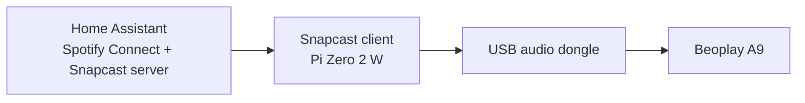

# balena_snapcast_server
Deploy a Snapcast and sendspin clients stack to Balena for multiroom audio. This setup pairs client with PulseAudio to play Home Assistant's Spotify Connect output on a Raspberry Pi Zero 2 W.

## Setup overview
- Home Assistant runs Spotify Connect and the Snapcast server or sendspin server.
- Snapcast client runs on a Pi Zero 2 W with a USB audio dongle.
- Audio chain: Spotify Connect -> Snapcast server -> Snapcast client -> USB audio -> speaker.



## Deploy with Balena
1) Create a Balena fleet.
2) Install the Balena CLI.
3) Deploy:
```bash
balena login
balena deploy <fleet>
```

## Configuration
Adjust these in `docker-compose.yml` or fleet variables:
- `SNAPCAST_VERSION` (default: `0.34.0`)
- `SOUND_VOLUME` (default: `180`)
- `snapclient` target server in `docker-compose.yml`:
  - `-h 192.168.1.38` (Snapcast server IP)
  - `--hostID pi-zero-beoplay`

## My local details
- Snapcast server / Home Assistant IP: `192.168.1.38`
- Balena fleet name: `iotsound`
- Snapcast server UI: `http://192.168.1.38:1780`

## Components
- Snapcast: multiroom audio system using a central server and lightweight clients. https://github.com/badaix/snapcast
- SendSpin: Spotify Connect endpoint that sends audio to PulseAudio. https://github.com/kevinykchan/sendspin
- Balena: Docker-based device management for fleets of embedded devices. https://w`docker.io/saiyato/snapclient:latest`
ww.balena.io/

## Alternative image
You can swap the Snapcast client build for a prebuilt image:

## Previous attempts
- IOTsound: seemed abandoned and failed to start a Snapcast client. <todo insert link>
- Older Snapcast-on-Balena setups: Alpine-based and small, but required building from source and were behind current Snapcast versions. `docker.io/saiyato/snapclient:latest`
<todo insert link>
