# Balena Snapcast Server

A Balena stack for multiroom audio using Snapcast with Spotify Connect support.

## Overview

This project deploys a complete multiroom audio system:
- **go-librespot** provides Spotify Connect endpoint
- **Snapserver** receives audio and distributes to clients
- **Snapclients** play synchronized audio on speakers across your network
- **SendSpin** (optional) Alternative pipeline used by Home Assisant/Music Assistant

```mermaid
flowchart LR
    subgraph server["Server Device"]
        direction LR
        spotify[Spotify App] -->|Connect| librespot[go-librespot]
        librespot -->|FIFO| snapserver[snapserver]
    end
    
    subgraph client1["Client 1"]
        direction LR
        sc1[snapclient] --> pa1[PulseAudio] --> spk1[🔊]
    end
    
    subgraph client2["Client 2"]
        direction LR
        sc2[snapclient] --> pa2[PulseAudio] --> spk2[🔊]
    end
    
    snapserver -->|synced| sc1
    snapserver -->|synced| sc2
```



## Components

- [Snapcast](https://github.com/badaix/snapcast) - Multiroom audio synchronization
- [go-librespot](https://github.com/devgianlu/go-librespot) - Spotify Connect client
- [SendSpin](https://github.com/kevinykchan/sendspin) - Alternative Spotify Connect client
- [PulseAudio](https://www.freedesktop.org/wiki/Software/PulseAudio/) - Audio server

## Quick Start

1. Create a Balena fleet for your device type
2. Deploy:
   ```bash
   balena login
   balena deploy <fleet-name> --build
   ```
3. Set `ENABLE_SERVER=on` on ONE device (the server)
4. Set `SNAPSERVER_HOST=<server-ip>` on client devices
5. Open Spotify and select your device name

## Environment Variables

Configure these in the Balena dashboard:

### Core Settings

| Variable | Default | Description |
|----------|---------|-------------|
| `ENABLE_SERVER` | `on` | Set to `off` on client-only devices |
| `ENABLE_SENDSPIN` | `off` | Set to `on` to use SendSpin instead of Snapcast |
| `SNAPSERVER_HOST` | `snapserver` | IP/hostname of the server (for client devices) |
| `SNAPCLIENT_ID` | `snapclient` | Client name shown in Snapserver web UI |

### Audio Settings

| Variable | Default | Description |
|----------|---------|-------------|
| `SOUND_VOLUME` | `120` | PulseAudio volume (100 = 100%, 150 = amplified) |
| `SPOTIFY_DEVICE_NAME` | `Snapcast` | Name shown in Spotify Connect |

### Debug/Testing

| Variable | Default | Description |
|----------|---------|-------------|
| `AUDIO_TEST` | `off` | Set to `on` to play continuous test tone with sync clap |

## Services

| Service | Purpose | Runs on |
|---------|---------|---------|
| `pulseaudio` | Audio output via USB | All devices |
| `snapclient` | Receives audio from snapserver | All devices |
| `sendspin` | Alternative Spotify Connect client | When enabled |
| `snapserver` | Distributes synced audio | Server only |
| `librespot` | Spotify Connect endpoint | Server only |
| `audiotest` | Debug tone generator | When enabled |

### Why PulseAudio?

PulseAudio is used as a mixing layer because this project supports multiple audio outputs (snapclient + optional sendspin). For a simpler setup using only Snapcast, PulseAudio could potentially be removed in favor of direct ALSA output - this remains a future simplification opportunity.

## Control & Management

### Snapserver Web UI
- URL: `http://<server-ip>:1780`
- Adjust per-client volume and latency
- Group clients for different audio zones
- Mute/unmute individual clients

### Snapcast Android App

For mobile control, use the [Snapcast Android app](https://play.google.com/store/apps/details?id=de.badaix.snapcast) to:
- Manage client groups
- Adjust volumes on the go
- Monitor connection status

### SendSpin Alternative

[SendSpin](https://github.com/kevinykchan/sendspin) is an alternative Spotify Connect client that outputs directly to PulseAudio/ALSA without using Snapcast. Enable it with `ENABLE_SENDSPIN=on` if you prefer a simpler single-device setup without multiroom sync.

## Ports

| Port | Protocol | Purpose |
|------|----------|---------|
| 1704 | TCP | Snapcast audio stream |
| 1705 | TCP | Snapcast control |
| 1780 | HTTP | Snapserver web UI |

## Typical Setup

**Server device** (e.g., always-on Pi):
```
ENABLE_SERVER=on
SPOTIFY_DEVICE_NAME=Living Room
SOUND_VOLUME=100
```

**Client devices** (e.g., speakers around the house):
```
ENABLE_SERVER=off
SNAPSERVER_HOST=192.168.1.100
SNAPCLIENT_ID=Kitchen
SOUND_VOLUME=120
```

## Hardware

### My Testing Setup

This is what I personally tested with and use:

**USB Sound Card:**
- [Sandberg USB-C to Sound Link](https://www.proshop.dk/Lydkort/Sandberg-USB-C-to-Sound-Link/2989998)
- [Pro Micro USB to USB-C adapter](https://www.proshop.dk/USB-kabel/Pro-Micro-USB-to-USB-C-adapter-black/2994982) (to connect to Pi Zero 2 W)

This combo worked out of the box with BalenaOS. Other projects like IOTSound support DAC HATs, but I haven't explored that.

**Raspberry Pi & Accessories:**
- [Raspberry Pi Zero 2 W](https://raspberrypi.dk/produkt/raspberry-pi-zero-2-w/) - This is what I tested on
- [Flirc Raspberry Pi Zero Heatsink Case](https://raspberrypi.dk/produkt/flirc-raspberry-pi-zero-heatsink-case/)
- [SanDisk High Endurance 64GB microSD](https://www.proshop.dk/Hukommelseskort/SANDISK-High-Endurance-microSDSD-100MBs-64GB/2773175)
- [StarTech.com USB adapter](https://www.proshop.dk/USB-kabel/StarTechcom-USB-adapter/2402408)

### My Actual Installation: Beoplay A9 mk2

How I have it installed:
- **Audio**: USB sound card → 3.5mm line-in on Beoplay A9
- **Power**: USB power from Beoplay's debug USB port
- **Result**: The whole Pi setup is hidden inside the speaker


## Troubleshooting

### No sound
1. Check `SNAPSERVER_HOST` points to correct IP
2. Set `AUDIO_TEST=on` to test speaker output
3. Check volume in Snapserver web UI (http://server:1780)

### Speakers out of sync
Adjust latency per-client in the Snapserver web UI

### TasksMax Workaround (Pi Zero 2 W)

On some BalenaOS devices (particularly Pi Zero 2 W), the default systemd TasksMax is too low, causing containers to fail with `pthread_create failed: Resource temporarily unavailable`. This workaround raises the limit:

```bash
mount -o remount,rw /
mkdir -p /etc/systemd/system/balena.service.d
cat <<'EOF' | tee /etc/systemd/system/balena.service.d/override.conf
[Service]
TasksMax=256
EOF
systemctl daemon-reload
systemctl restart balena
```

## Inspiration & Previous Attempts

This project was created after existing solutions that didn't quite work for me:

- **IOTSound**: Seemed abandoned and failed to start a Snapcast client properly. 
- **Older Snapcast-on-Balena setups**: Alpine-based Docker images (like `docker.io/saiyato/snapclient:latest`) were small but required building from source and were behind current Snapcast versions. Alpine gives significantly smaller images though.

## License

GPLv3 - See [LICENSE](LICENSE)
